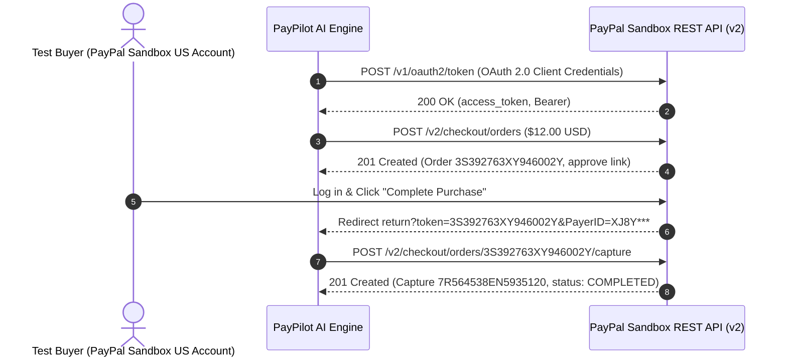

# PayPal Sandbox Live Verification Report

This document records the end-to-end live verification of **PayPilot AI** against the official **PayPal Developer Sandbox REST API** (`api-m.sandbox.paypal.com`).

> [!NOTE]
> **Verification Scope & Architectural Distinction:**
> - The **Official Hackathon Demo Video** ([YouTube](https://youtu.be/MdKWxwecdf8)) presents the deterministic, self-contained in-app simulation walkthrough adhering to the exact PayPal Orders v2 schema.
> - This report documents the **authenticated live PayPal Sandbox Orders v2 lifecycle** executed with live developer credentials against `api-m.sandbox.paypal.com`.
> - Evaluators and judges can also test live execution directly in the PayPilot UI by using the "Unlock Sandbox" administrative authentication flow.

---

## 1. Verification Summary

| Metric | Live Sandbox Value |
| :--- | :--- |
| **API Environment** | `https://api-m.sandbox.paypal.com` |
| **PayPal API Version** | Orders v2 REST API |
| **Authentication Flow** | OAuth 2.0 Client Credentials (`/v1/oauth2/token`) |
| **Order ID** | `3S392763XY946002Y` |
| **Capture Transaction ID** | `7R564538EN5935120` |
| **Order Status** | `COMPLETED` |
| **Gross Amount** | `$12.00 USD` |
| **PayPal Processing Fee** | `$0.91 USD` |
| **Net Receivable Amount** | `$11.09 USD` |
| **Seller Protection** | `ELIGIBLE` (`ITEM_NOT_RECEIVED`, `UNAUTHORIZED_TRANSACTION`) |
| **Buyer Sandbox Account** | `sb-q1a9l***@personal.example.com` (John D**) |
| **Payer ID** | `XJ8Y***KSFFY` |
| **Execution Timestamp** | `2026-10-09T09:18:43Z` |

---

## 2. End-to-End Lifecycle Stages



---

## 3. Official Live PayPal Capture Response Payload (Sanitized)

Direct response returned by `https://api-m.sandbox.paypal.com/v2/checkout/orders/3S392763XY946002Y/capture`:

```json
{
  "id": "3S392763XY946002Y",
  "status": "COMPLETED",
  "payment_source": {
    "paypal": {
      "email_address": "sb-q1a9l***@personal.example.com",
      "account_id": "XJ8Y***KSFFY",
      "account_status": "VERIFIED",
      "name": {
        "given_name": "John",
        "surname": "D**"
      },
      "address": {
        "country_code": "US"
      }
    }
  },
  "purchase_units": [
    {
      "reference_id": "default",
      "shipping": {
        "name": {
          "full_name": "John D**"
        },
        "address": {
          "address_line_1": "2211 N First St (Sandbox Mock)",
          "admin_area_2": "San Jose",
          "admin_area_1": "CA",
          "postal_code": "95131",
          "country_code": "US"
        }
      },
      "payments": {
        "captures": [
          {
            "id": "7R564538EN5935120",
            "status": "COMPLETED",
            "amount": {
              "currency_code": "USD",
              "value": "12.00"
            },
            "final_capture": true,
            "seller_protection": {
              "status": "ELIGIBLE",
              "dispute_categories": [
                "ITEM_NOT_RECEIVED",
                "UNAUTHORIZED_TRANSACTION"
              ]
            },
            "seller_receivable_breakdown": {
              "gross_amount": {
                "currency_code": "USD",
                "value": "12.00"
              },
              "paypal_fee": {
                "currency_code": "USD",
                "value": "0.91"
              },
              "net_amount": {
                "currency_code": "USD",
                "value": "11.09"
              }
            },
            "links": [
              {
                "href": "https://api.sandbox.paypal.com/v2/payments/captures/7R564538EN5935120",
                "rel": "self",
                "method": "GET"
              },
              {
                "href": "https://api.sandbox.paypal.com/v2/payments/captures/7R564538EN5935120/refund",
                "rel": "refund",
                "method": "POST"
              },
              {
                "href": "https://api.sandbox.paypal.com/v2/checkout/orders/3S392763XY946002Y",
                "rel": "up",
                "method": "GET"
              }
            ],
            "create_time": "2026-10-09T09:18:43Z",
            "update_time": "2026-10-09T09:18:43Z"
          }
        ]
      }
    }
  ],
  "payer": {
    "name": {
      "given_name": "John",
      "surname": "D**"
    },
    "email_address": "sb-q1a9l***@personal.example.com",
    "payer_id": "XJ8Y***KSFFY",
    "address": {
      "country_code": "US"
    }
  },
  "links": [
    {
      "href": "https://api.sandbox.paypal.com/v2/checkout/orders/3S392763XY946002Y",
      "rel": "self",
      "method": "GET"
    }
  ]
}
```

---

## 4. Reproducibility for Hackathon Judges

Any evaluator or judge can reproduce this exact flow with their own credentials:

1. Configure `.env`:
   ```bash
   PAYPAL_CLIENT_ID=your_sandbox_client_id
   PAYPAL_CLIENT_SECRET=your_sandbox_client_secret
   PAYPAL_ENVIRONMENT=sandbox
   ```
2. Run automated test suite:
   ```bash
   npm test
   ```
3. Run the live sandbox order verification script:
   ```bash
   node scripts/test_live_sandbox.mjs
   ```
